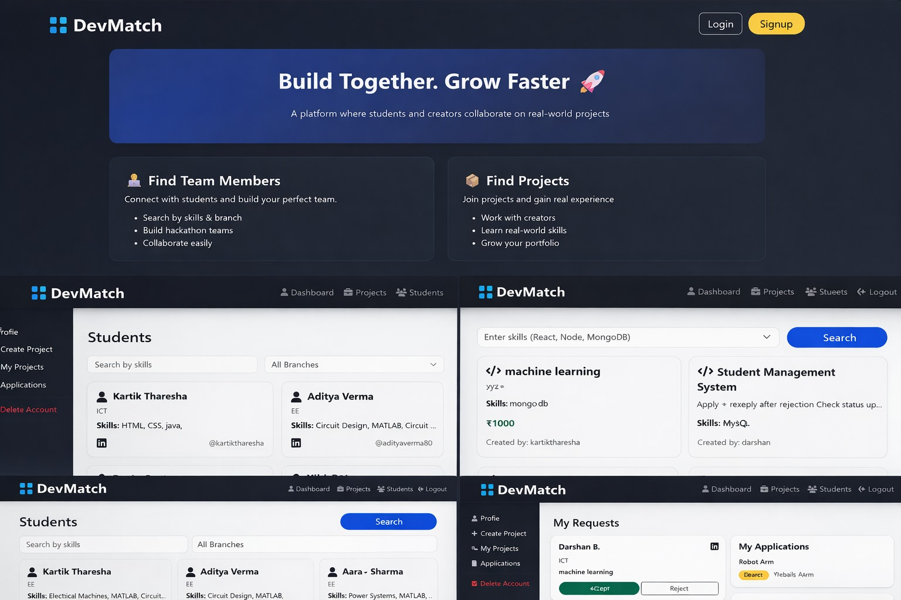

# DevMatch

DevMatch is a web platform I built to help students connect and find project partners based on their skills. It simplifies the process of building teams for hackathons or academic projects.

 -> What it does
* User Profiles: Users can create profiles and list their tech stack.
* Collaboration: A system to post project ideas and find interested teammates.
* Backend: Built using Node.js to handle data flow and user requests.

 -> Technical Stack
* Backend: Node.js & Express.js
* Database: MongoDB
* View Engine: EJS
* Language: JavaScript

->Preview

-> How to Run Locally
1. Clone the repo: `git clone https://github.com/kartiktharesha/DevMatch.git`
2. Install packages: `npm install`
3. Run the app: `node app.js` (or `npm start`)

-> Key Takeaways
By building this project, I learned how to:
- Design and implement RESTful APIs.
- Perform CRUD operations with MongoDB.
- Handle dynamic content rendering with EJS.  
